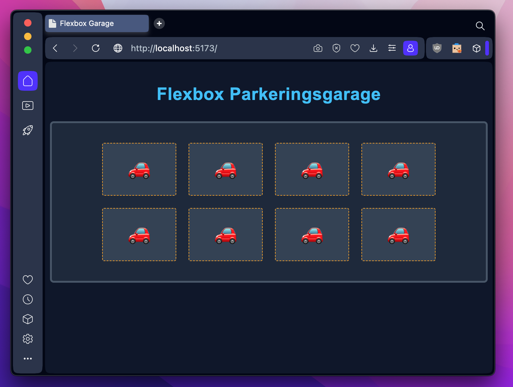

# Exercise 1: "The Linear Garage" (CSS Flexbox)

**Program:** Lexicon / LTU (VT-2026)  
**Course:** HTML / CSS  
**Tags:** `html` `css` `flexbox` `css-flexbox` `vite` `stylus`

---

A clean front-end exercise for a linear car garage project, built using CSS Flexbox, Vite, and Stylus. The project is structured to separate source code from configuration and compiled production assets.

## Project Structure

The project source code lives in the `src/` directory, while the production-ready assets are generated inside the `dist/` folder.

    /root
      ├── dist/                 # Generated upon production build (tracked in .gitignore)
      ├── docs/                 # Assignment documentation and PDFs
      │   ├── exercise-flexbox.pdf
      │   └── presentation-flexbox.pdf
      ├── node_modules/         # Installed dependencies
      ├── src/                  # Source files (Vite root)
      │   ├── assets/
      │   │   ├── images/       # Project screenshots and assets
      │   │   │   └── preview.png
      │   │   ├── scripts/      # JavaScript files
      │   │   │   └── main.js
      │   │   └── styles/       # Stylus stylesheets
      │   │       └── main.styl
      │   └── index.html        # Main HTML entry point
      ├── .browserslistrc       # Target browsers for Autoprefixer
      ├── .gitignore
      ├── package-lock.json
      ├── package.json
      ├── postcss.config.js     # PostCSS configuration (Autoprefixer)
      ├── README.md             # Project documentation
      └── vite.config.js

## Getting Started

Follow these steps to install the necessary dependencies and run the project locally.

### 1. Install Dependencies
Before running the project for the first time, install all required packages (including Vite, Stylus, and Autoprefixer):

    npm install

### 2. Start the Development Server
To launch the local development server with Hot Module Replacement (HMR), run:

    npm run dev

Click the `http://localhost:5173` link displayed in your terminal to open the project in your browser. Any changes made to the source files will reflect instantly without requiring a manual page reload.

### 3. Build for Production
When the project is complete and ready for deployment, generate the optimized, minified, and prefixed production assets by running:

    npm run build

The compiled files will be outputted to the `dist/` directory.

### 4. Preview the Production Build
To verify that the production build in the `dist/` directory works exactly as expected before deploying, you can spin up a local preview server:

    npm run preview
